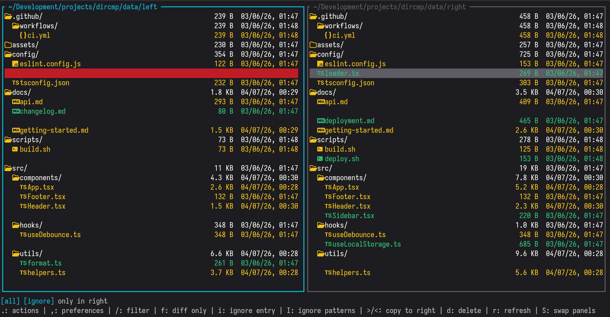

# dircmp

Terminal TUI for comparing two directories side by side.



## Features

- **Side-by-side tree view** with color-coded diff status
- **Vim keybindings** for fast navigation (`j/k/h/l`, `gg/G`, `Ctrl+D/U`)
- **Built-in unified diff viewer** with line-level added/removed counts
- **Copy, delete, and sync** entries between directories
- **Gitignore-style ignore patterns** (global and per-directory-pair)
- **Live search filtering** with `/`
- **Remote directory support** via rclone (SFTP, S3, GCS)
- **Shell completions** for bash, zsh, and fish
- **Configurable** preferences, keybindings, and external diff command
- **Nerd Font icons** for file types
- **Dark/light theme** auto-detection

## Installation

### npx (no install)

```sh
npx @ilyasturki/dircmp <left-dir> <right-dir>
```

### Homebrew

```sh
brew install ilyasturki/dircmp/dircmp
```

### npm

```sh
npm install -g @ilyasturki/dircmp
```

### Nix

```sh
nix run github:ilyasturki/dircmp -- <left-dir> <right-dir>
```

Or add to your flake inputs and install the package:

```nix
{
  inputs.dircmp.url = "github:ilyasturki/dircmp";
}
```

Then add it to your installed packages:

```nix
environment.systemPackages = [
  inputs.dircmp.packages.${pkgs.system}.default
];
```

### Build from source

```sh
git clone https://github.com/ilyasturki/dircmp.git
cd dircmp
bun install
bun run build
./dircmp <left-dir> <right-dir>
```

## Usage

```sh
dircmp <left-dir> <right-dir>
```

### CLI subcommands

**`diff`** — print differences to stdout:

```sh
dircmp diff <left-dir> <right-dir>
dircmp diff <left-dir> <right-dir> --format json
dircmp diff <left-dir> <right-dir> --only modified
dircmp diff <left-dir> <right-dir> --stat
```

Formats: `tree` (default), `flat`, `json`. Filters: `modified`, `left-only`, `right-only`.

**`check`** — silent comparison for scripts and CI:

```sh
dircmp check <left-dir> <right-dir>        # exits 0 if identical, 1 if different
dircmp check <left-dir> <right-dir> --stat  # print summary before exiting
```

**`completions`** — generate shell completions:

```sh
dircmp completions bash >> ~/.bashrc
dircmp completions zsh >> ~/.zshrc
dircmp completions fish > ~/.config/fish/completions/dircmp.fish
```

### Remote directories

Requires [rclone](https://rclone.org). Supports SFTP, S3, GCS, and named rclone remotes:

```sh
dircmp ./local-dir sftp://user@host/path
dircmp ./local-dir s3://bucket/prefix
dircmp ./local-dir gcs://bucket/prefix
dircmp ./local-dir myremote:path
```

### Flags

| Flag                 | Description                              |
| -------------------- | ---------------------------------------- |
| `--no-ignore`        | Don't apply ignore patterns              |
| `--ignore <pattern>` | Add a custom ignore pattern (repeatable) |
| `--help`, `-h`       | Show help                                |
| `--version`, `-v`    | Show version                             |

## Keybindings

All keybindings are customizable via `~/.config/dircmp/keybindings.json` or the in-app editor (`K`).

### Navigation

| Key       | Action              |
| --------- | ------------------- |
| `j` / `↓` | Move cursor down    |
| `k` / `↑` | Move cursor up      |
| `G`       | Jump to last entry  |
| `gg`      | Jump to first entry |
| `Ctrl+d`  | Half page down      |
| `Ctrl+u`  | Half page up        |
| `Ctrl+f`  | Full page down      |
| `Ctrl+b`  | Full page up        |
| `Tab`     | Switch panel focus  |
| `H`       | Focus left panel    |
| `L`       | Focus right panel   |

### Tree

| Key       | Action                             |
| --------- | ---------------------------------- |
| `l` / `→` | Expand directory or enter file     |
| `h` / `←` | Collapse directory or go to parent |
| `Enter`   | Open unified diff view             |
| `zR`      | Expand all directories             |
| `zM`      | Collapse all directories           |
| `]c`      | Jump to next difference            |
| `[c`      | Jump to previous difference        |

### Actions

| Key | Action                      |
| --- | --------------------------- |
| `>` | Copy entry to right         |
| `<` | Copy entry to left          |
| `d` | Delete selected entry       |
| `y` | Yank file path to clipboard |
| `r` | Refresh comparison          |
| `S` | Swap panels                 |

### Filtering & Config

| Key  | Action                    |
| ---- | ------------------------- |
| `/`  | Filter entries by name    |
| `f`  | Toggle diff-only filter   |
| `i`  | Quick-add entry to ignore |
| `I`  | Manage ignore patterns    |
| `zi` | Toggle ignore filtering   |
| `,`  | Open preferences          |
| `.`  | Open actions menu         |
| `K`  | Open keybindings editor   |
| `?`  | Show all keybindings      |
| `q`  | Quit                      |

## Configuration

### Preferences

Stored in `~/.config/dircmp/config.json`:

```json
{
    "dateLocale": "en-US",
    "showHints": true,
    "compareDates": true,
    "diffCommand": "nvim -d"
}
```

| Option         | Description                                      |
| -------------- | ------------------------------------------------ |
| `dateLocale`   | Locale for date formatting                       |
| `showHints`    | Show keyboard hints in the status bar            |
| `compareDates` | Include modification dates in file comparison    |
| `diffCommand`  | External diff command (e.g., `nvim -d`, `delta`) |

### Ignore patterns

Patterns use gitignore syntax and are stored in:

- **Global:** `~/.local/share/dircmp/ignore`
- **Per directory pair:** `~/.local/share/dircmp/pairs/<hash>.ignore`

Default ignored: `.git`, `node_modules`, `.DS_Store`.

## Color coding

| Color  | Meaning                    |
| ------ | -------------------------- |
| Yellow | Modified (content differs) |
| Green  | Only exists on one side    |
| Red    | Missing from this side     |
| Dim    | Identical                  |

## License

[MIT](LICENSE)
